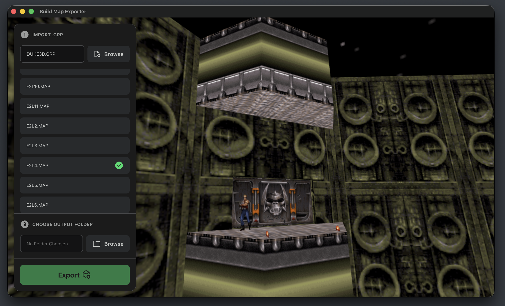

# Build Engine Map Exporter

A map viewer and export tool for **Build Engine** games, including **Duke Nukem 3D**, **Shadow Warrior**, and **Blood**.



[preview.webm](https://github.com/user-attachments/assets/5c749ded-922c-4cd5-9732-b25fe388d720)

---

## Download

Download the latest release for your platform from the [Releases page](https://github.com/Steveeeie/build-engine-map-exporter/releases/latest).

---

## Features

- Import `.GRP` files from supported Build Engine games
- Export maps to `.obj` format
- Includes **textures** and **sprites**
- Exported `.obj` files can be imported into most 3D tools, including **Blender**, **Maya**, **3ds Max**, and others

---

## Sponsor

<a href="https://github.com/sponsors/Steveeeie"></a>

If you find this project useful, consider sponsoring me or making a one-time donation so I can do more like this in the future.

[Sponsor](https://github.com/sponsors/Steveeeie)

---

## Feature Requests and Contributions

Contributions are welcome.

Please report bugs or make any feature requests via the GitHub issue tracker. Don't contact me directly. My availability is limited, and using issues helps ensure requests aren't lost over time and allows others to contribute fixes via pull requests.

If you fork or build upon this project, please credit the original.

---

## Related Links

The following resources were invaluable when creating this tool:

- [Ken Silverman’s Build Engine Page](https://advsys.net/ken/build.htm)
- [Chocolate Duke](https://github.com/fabiensanglard/chocolate_duke3D)
- [JonoF’s Duke Nukem 3D Port](https://github.com/jonof/jfduke3d)

---

## Developer Documentation

### Prerequisites

You will need the following installed:

- [Node.js](https://nodejs.org/en)

You should be familiar with:

- [TypeScript](https://www.typescriptlang.org/)
- [React](https://react.dev/)
- [Three.js](https://threejs.org/)

---

### Installation

1. Clone the repository:

```bash
git clone https://github.com/Steveeeie/build-map-exporter.git
```

2. Change into project directory

```bash
cd build-map-exporter
```

3. Install dependencies

```bash
npm install
```

4. Run locally

```bash
npm start
```
